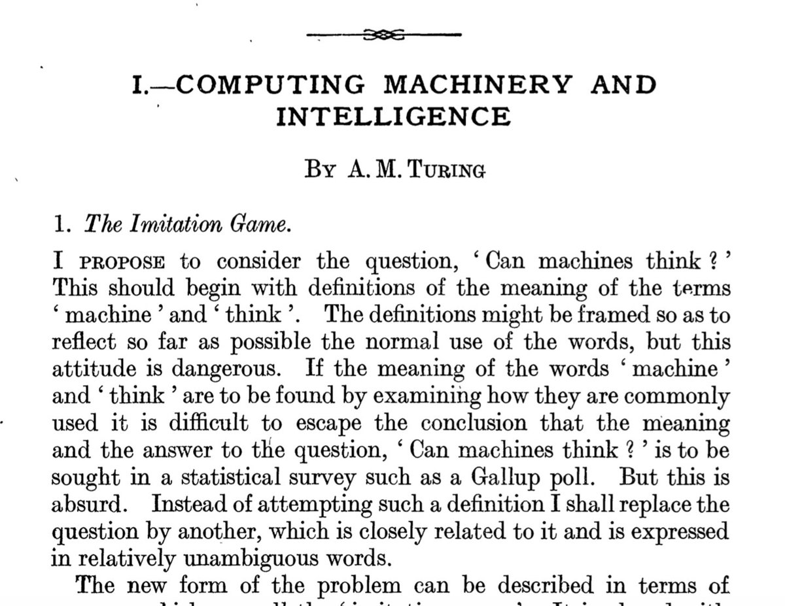

Lorem Ipsum

## Slide com imagem

The Imitation Game: "Can machines think?"



---

# Uma divisão de Sessão

## Slide com imagem redimensionada

Para controle fino sobre o tamanho e alinhamento, o uso de comandos LaTeX dentro do Markdown é uma excelente opção.

\begin{center}
\includegraphics[width=0.7\textwidth]{figuras/dartmouth.png}
\end{center}

---

## Slide com Listas

### Lista Não Ordenada (Bullets)
* Item principal 1
* Item principal 2
    * Sub-item 2.1
    * Sub-item 2.2

### Lista Ordenada
1. Primeiro passo do processo.
2. Segundo passo do processo.
3. Terceiro e último passo.

---

## Slide com Conteúdo Incremental (Pausas)

Use `>-` para fazer com que os itens da lista apareçam um por um a cada avanço do slide.

> - Este é o primeiro ponto a ser revelado.
> - Com um clique, o segundo ponto aparece.
> - E por fim, o terceiro.
> - A animação pode ser aplicada a qualquer bloco de conteúdo.

---

## Slide com código, inclusive LaTeX

Para facilitar a leitura foi utilizado um comando vspace entre os trechos de código.

\vspace{0.5cm}

```{.java}
System.out.println("Olá FIAP");
````

\vspace{0.5cm}

```{.python}
def funcao(x):
    return x * x
```

\vspace{0.5cm}

A famosa identidade de Euler: $e^{i\pi} + 1 = 0$

-----

## Slide com imagem e texto lado-a-lado (50%/50%)

:::::::::::::: {.columns}
::: {.column width="50%"}

  * **The Imitation Game**. 2014. Directed by Morten Tyldum.
  * **Entrevista com o John McCarthy** (1927-2011), 1989. [https://www.youtube.com/watch?v=Ozipf13jRr4](https://www.youtube.com/watch?v=Ozipf13jRr4)
  * Minsky, Marvin (1986). **The Society of Mind**. New York: Simon & Schuster. ISBN 0-671-60740-5.
  * McCarthy, John. **What is AI?**. [http://jmc.stanford.edu/articles/whatisai.html](http://jmc.stanford.edu/articles/whatisai.html). November, 2007.
:::
::: {.column width="50%"}
\includegraphics[width=0.7\textwidth]{figuras/dartmouth.png}
:::
::::::::::::::

-----

## Slide com Colunas de Larguras Diferentes (70%/30%)

:::::::::::::: {.columns}
::: {.column width="70%"}

### Conteúdo Principal

É possível ajustar a proporção das colunas para dar ênfase a um dos lados. Esta coluna ocupa 70% da largura, ideal para textos mais longos ou blocos de código complexos que precisam de mais espaço.

Lorem ipsum dolor sit amet, consectetur adipiscing elit, sed do eiusmod tempor incididunt ut labore et dolore magna aliqua.
:::
::: {.column width="30%"}

### Barra Lateral

Esta coluna, com 30%, serve como uma barra lateral para notas, imagens menores ou legendas.
\begin{center}
\includegraphics[width=\textwidth]{figuras/dartmouth.png}
\end{center}
:::
::::::::::::::

-----

## Slide com Blocos de Destaque

O Beamer oferece ambientes para destacar diferentes tipos de informação.

\begin{block}{Exemplo de Bloco Padrão}
Use este bloco para agrupar informações gerais ou um conceito chave.
\end{block}

\begin{alertblock}{Exemplo de Bloco de Alerta}
Ideal para avisos, pontos críticos ou informações que exigem atenção imediata.
\end{alertblock}

\begin{exampleblock}{Exemplo de Bloco de Exemplo}
Perfeito para demonstrar um caso de uso, um exercício ou um exemplo prático.
\end{exampleblock}

-----

## Slide com Tabela

Tabelas podem ser criadas com a sintaxe simples do Markdown.

| Framework       | Linguagem     | Foco Principal      |
|-----------------|---------------|---------------------|
| Django          | Python        | Backend (Full-stack)|
| React           | JavaScript    | Frontend (UI)       |
| Laravel         | PHP           | Backend (MVC)       |

: Tabela comparativa de frameworks web.

-----

## Apenas texto

**Purus**: Lorem ipsum est purus suspendisse donec lectus ornare convallis gravida sapien vivamus, lorem interdum mi ultrices tempus sollicitudin litora sem dui in et, duis donec imperdiet eu nec quisque pharetra ac diam primis. habitasse dictum ultricies

\vspace{1cm}

**Faucibus**: Per faucibus metus mollis id consectetur, dui per diam eget fames, bibendum nullam quisque vitae. at pellentesque vulputate felis mauris diam tristique aptent taciti massa, mollis suscipit quam enim habitasse aliquet quam euismod, purus eget torquent amet sapien erat dictum id.

-----

# Fim

## Slide de Conclusão

**Obrigado!**

\vfill

Perguntas?

